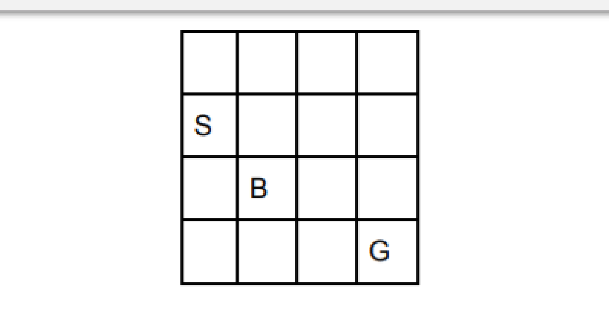
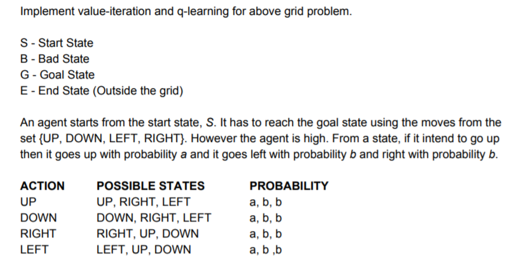
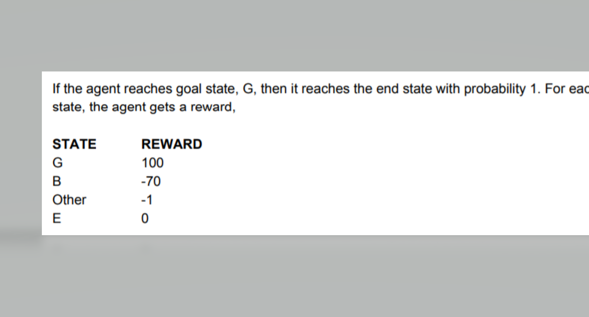

# Reinforcement-Learning
Implementation of RL problems

The implementation of the Value Iteration and Q-Learning policy are done right now on the gridworld. 

The sample problem is taken as below - 

